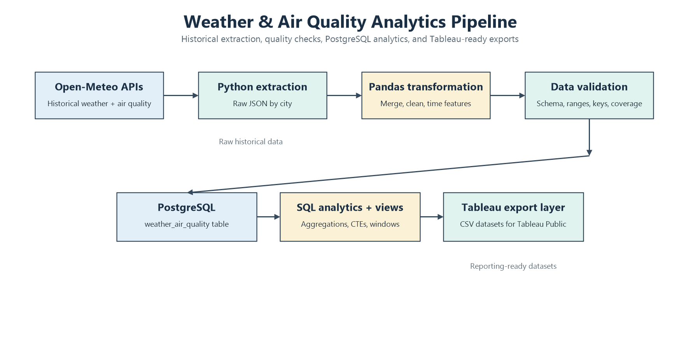
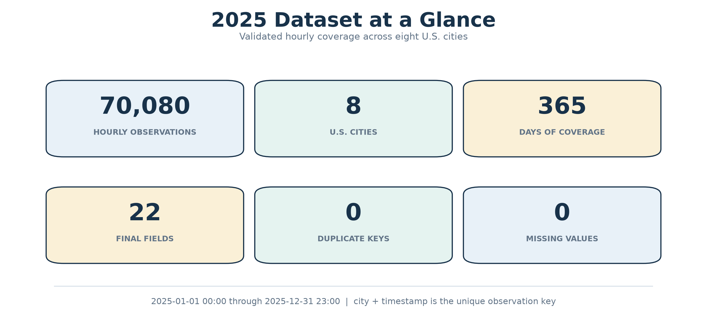

# Weather & Air Quality Analytics Pipeline

An end-to-end Python and PostgreSQL analytics pipeline for collecting,
transforming, validating, and analyzing hourly weather and air-quality data
across eight U.S. cities.

The project uses the Open-Meteo Weather and Air Quality APIs, combines the
responses into an analytics-ready dataset, loads the result into PostgreSQL,
and exports reporting tables for Tableau Public.



## Project Snapshot

| Measure | Result |
| --- | ---: |
| Historical period | January 1 through December 31, 2025 |
| Hourly observations | **70,080** |
| Cities | **8** |
| Hours per city | **8,760** |
| Final dataset fields | **22** |
| Duplicate city/timestamp keys | **0** |
| Missing values after transformation | **0** |



## What This Project Answers

The SQL analysis layer is designed to explore questions such as:

- How does average AQI vary across cities and months?
- Which city/month combinations have the highest average AQI?
- How do PM2.5 and PM10 levels compare geographically?
- How does average AQI vary by hour of day and day of week?
- How many hours does each city spend above AQI 100?
- What patterns appear when observations are grouped by wind speed,
  precipitation, or temperature?

These are descriptive comparisons and associations. The project does not
claim that weather variables cause changes in air quality.

## Data Coverage

The historical dataset contains one hourly observation for each configured
city and timestamp:

- Salt Lake City
- Denver
- Los Angeles
- Seattle
- Chicago
- New York
- Houston
- Phoenix

The expected coverage is:

```text
8 cities × 8,760 hours = 70,080 observations
2025-01-01 00:00:00 through 2025-12-31 23:00:00
```

The observation key is `city` + `timestamp`.

## Pipeline Architecture

1. **Extract** — Historical weather data is retrieved from the Open-Meteo
   Archive API and historical air-quality data from the Open-Meteo Air Quality
   API. Raw responses are stored as JSON files by city.
2. **Transform** — The JSON hourly arrays are converted to Pandas DataFrames,
   combined by source, merged by city and timestamp, cleaned, sorted, and
   enriched with date, year, month, day, hour, and day-of-week fields.
3. **Validate** — The processed CSV is checked for schema completeness, city
   coverage, timestamp validity, date bounds, duplicate keys, valid humidity
   and cloud-cover ranges, non-negative measurements, and missing values.
4. **Load** — Validated records are inserted into PostgreSQL with a unique
   `(city, timestamp)` constraint and an idempotent `ON CONFLICT DO NOTHING`
   rule.
5. **Analyze** — PostgreSQL queries and reusable views provide geographic,
   monthly, daily, hourly, weekday, category, and weather-group analysis.
6. **Export** — The table and analytics views are exported to CSV files for
   Tableau Public.

## Repository Implementation

| Stage | Implementation |
| --- | --- |
| Location configuration | `src/config/locations.py` |
| Historical weather extraction | `src/extract/extract_historical.py` |
| Historical air-quality extraction | `src/extract/extract_historical_air_quality.py` |
| JSON-to-table transformation | `src/transform/transform_historical.py` |
| Data-quality validation | `src/validation/validate_data.py` |
| PostgreSQL loading and verification | `src/load/load_postgres.py` |
| Tableau CSV export | `src/load/export_tableau.py` |
| PostgreSQL table and indexes | `sql/schema/create_tables.sql` |
| Analytics views | `sql/schema/create_analytics_views.sql` |
| SQL analysis | `sql/analysis/weather_air_quality_analysis.sql` |

## Data Quality Checks

`src/validation/validate_data.py` implements the following checks:

- All 22 required columns are present
- All configured cities are present, with no unexpected cities
- `city` + `timestamp` values are unique
- Timestamps parse successfully
- The dataset starts at `2025-01-01 00:00:00`
- The dataset ends at `2025-12-31 23:00:00`
- Relative humidity is between 0 and 100
- Cloud cover is between 0 and 100
- Precipitation is non-negative
- Wind speed is non-negative
- PM2.5, PM10, carbon monoxide, nitrogen dioxide, sulphur dioxide,
  ozone, and U.S. AQI are non-negative
- Missing values are reported by column

The transformation summary reports row count, field count, city count,
timestamp bounds, duplicate city/timestamp keys, total missing values, and
rows by city.

## PostgreSQL Analytics Layer

The main table is `weather_air_quality`. The schema includes:

- A generated `BIGSERIAL` primary key
- Weather measurements
- Air-quality measurements
- Derived calendar fields
- A unique constraint on `(city, timestamp)`
- Indexes for city, timestamp, city/timestamp, AQI, and date filtering
- Database-level checks for valid ranges and non-negative measurements

The loader reads PostgreSQL settings from environment variables, verifies that
the destination table exists, inserts the processed records, and checks:

- Expected and actual row counts
- Number of cities
- Minimum and maximum timestamps
- Duplicate city/timestamp keys

The repository defines these analytics views:

- `vw_city_air_quality_summary`
- `vw_monthly_air_quality`
- `vw_daily_air_quality`
- `vw_hourly_patterns`
- `vw_aqi_categories`

## SQL Analysis

The analysis script demonstrates:

- City-level AQI, PM2.5, PM10, ozone, and observation summaries
- Monthly and daily air-quality aggregation
- AQI category distributions
- Conditional aggregation with PostgreSQL `FILTER`
- AQI threshold analysis for hours above 100
- City ranking with `RANK()`
- Worst-day identification with `ROW_NUMBER()`
- Month-over-month comparison with `LAG()`
- CTEs and window functions
- AQI comparisons across hour, weekday, wind-speed, precipitation, and
  temperature groups

## Tableau Dashboard

**Dashboard visualization layer in progress.**

The repository includes the data-export layer needed to prepare Tableau Public
inputs, but it does not currently contain a completed Tableau workbook or
dashboard screenshot.

The exporter prepares:

- Hourly weather and air-quality data
- City-level air-quality summaries
- Monthly air-quality summaries
- Daily air-quality summaries
- Hourly pattern summaries
- AQI category summaries

Planned dashboard views include city AQI comparisons, monthly AQI trends, AQI
category distributions, wind-speed comparisons, hourly patterns, PM2.5
comparisons, and summary KPIs.

## Technology Stack

| Technology | Role |
| --- | --- |
| Python | Pipeline implementation |
| Requests | Open-Meteo API requests |
| Pandas | Transformation and CSV processing |
| PostgreSQL | Relational analytics database |
| SQL | Analysis and reusable views |
| psycopg2-binary | PostgreSQL connectivity and inserts |
| python-dotenv | Environment-based configuration |
| Tableau Public | Planned reporting and visualization layer |
| Git / GitHub | Version control and repository hosting |

## Repository Structure

```text
weather-air-quality-analysis-pipeline/
├── data/
│   ├── processed/
│   ├── raw/
│   │   ├── air_quality/
│   │   └── weather/
│   └── tableau/
├── docs/
│   └── images/
├── src/
│   ├── config/
│   ├── extract/
│   ├── load/
│   ├── transform/
│   └── validation/
├── sql/
│   ├── analysis/
│   └── schema/
├── dashboard/
├── notebooks/
├── tests/
├── logs/
├── .env.example
├── .gitignore
├── LICENSE
├── README.md
└── requirements.txt
```

Generated raw data, processed data, Tableau CSV exports, logs, environment
files, and virtual environments are excluded by `.gitignore`. Directory
placeholders are retained with `.gitkeep` files.

## Setup

These commands use Windows PowerShell:

```powershell
git clone https://github.com/Hypersb/weather-air-quality-analysis-pipeline.git
cd weather-air-quality-analysis-pipeline
python -m venv .venv
.\.venv\Scripts\Activate.ps1
pip install -r requirements.txt
Copy-Item .env.example .env
```

Edit `.env` with the local PostgreSQL connection values:

```text
DB_HOST=localhost
DB_PORT=5432
DB_NAME=weather_air_quality_db
DB_USER=postgres
DB_PASSWORD=your_password_here
```

The Open-Meteo endpoints used by the extraction modules do not require an API
key. Database credentials are loaded from `.env`, which is ignored by Git.
`.env.example` contains placeholders only.

## Running the Pipeline

### 1. Extract historical data

```powershell
python -m src.extract.extract_historical
python -m src.extract.extract_historical_air_quality
```

These commands save raw JSON files under:

```text
data/raw/weather/historical/
data/raw/air_quality/historical/
```

### 2. Transform the historical data

```powershell
python -m src.transform.transform_historical
```

The output is written to:

```text
data/processed/weather_air_quality_2025.csv
```

### 3. Validate the processed dataset

```powershell
python -m src.validation.validate_data
```

### 4. Create the PostgreSQL schema

Run the schema file with `psql`:

```powershell
psql -U postgres -d weather_air_quality_db -f sql/schema/create_tables.sql
```

If `psql` is not on `PATH`, run the `psql.exe` supplied by the local
PostgreSQL installation.

### 5. Load and verify the data

```powershell
python -m src.load.load_postgres
```

### 6. Create analytics views

```powershell
psql -U postgres -d weather_air_quality_db -f sql/schema/create_analytics_views.sql
```

### 7. Export Tableau datasets

```powershell
python -m src.load.export_tableau
```

CSV exports are written to `data/tableau/` and are intentionally ignored by
Git.

## Skills Demonstrated

- REST API integration
- Python ETL development
- Pandas data transformation
- Data cleaning and validation
- PostgreSQL schema design and loading
- Analytical SQL
- CTEs and window functions
- Reproducible reporting-data exports
- Environment-based configuration
- Git and GitHub workflows

## Future Improvements

The following are potential future enhancements, not current functionality:

- Scheduled pipeline execution
- Incremental database loading
- Expanded city coverage
- Automated unit and integration tests
- Continuous integration validation
- Cloud-hosted PostgreSQL
- Automated Tableau refresh workflow

## License

This project is released under the [MIT License](LICENSE).
